# 🔗 TaxRise Salesforce Object Relationships Knowledge Base

## 📋 **Table of Contents**
1. [Core Business Objects](#core-business-objects)
2. [Object Relationships Map](#object-relationships-map)
3. [Common Query Patterns](#common-query-patterns)
4. [Business Rules](#business-rules)
5. [Relationship-Aware Tools](#relationship-aware-tools)

---

## 🏢 **Core Business Objects**

### **Client Management**
- **Account** (Client) - Main client record
- **Contact** - Individual contact (Person Accounts)
- **Case__c** (Custom Case) - Tax resolution/prep cases
- **TaxConsultation__c** - Tax consultation records

### **Document & Tax Prep**
- **Document__c** - Tax documents and returns
- **TaxPrepInformation__c** - Tax preparation data
- **Tax_Return_Task__c** - Tax return processing tasks

### **Financial & Payment**
- **Payment__c** - Payment records
- **FinanceApplication__c** - Financing applications  
- **Scheduled_Payment__c** - Scheduled payment records
- **Income__c** - Income records
- **Asset__c** - Asset information

### **Standard Salesforce**
- **Opportunity** - Sales opportunities
- **User** - System users/agents
- **ContentVersion** & **ContentDocumentLink** - File attachments

---

## 🗺️ **Object Relationships Map**

### **Case__c** (Custom Case) - The Hub Object

```mermaid
graph TD
    Case[Case__c] --> Account[Account<br/>Client__c]
    Case --> Resolution[Case__c<br/>Resolution_Case__c]
    Case --> Subcase[Subcase__c<br/>Subcase__c]
    Case --> TaxConsult[TaxConsultation__c<br/>TaxConsultation__c]
    Case --> TIDoc[TI_Document__c<br/>TI_Document__c]
    Case --> ResOpp[Opportunity<br/>ResolutionOpportunity__c]
    Case --> TaxInvOpp[Opportunity<br/>TaxInvestigationOpportunity__c]
    
    %% User Relationships
    Case --> FinanceManager[User<br/>Finance_Manager__c]
    Case --> FinanceSpecialist[User<br/>Finance_Specialist__c]
    Case --> OnboardingSpec[User<br/>Onboarding_Specialist__c]
    Case --> ResolutionSpec[User<br/>Resolution_Specialist__c]
    Case --> TaxPrepAgent[User<br/>Tax_Prep_Agent__c]
    Case --> TaxPreparer[User<br/>Tax_Preparer__c]
    Case --> TaxPro[User<br/>TaxProfessional__c]
    
    %% External Relationships
    Case --> CreditReport[creditchecker__Credit_Report__c<br/>Spouse_Credit_Report__c]
    Case --> RevenueOff[Contact<br/>RevenueOfficer__c]
    Case --> POAReq[poa_requests__x<br/>poa_requests__c]
```


### **Document__c** Relationships
- **Case__c** → `Case__c` (required lookup to Custom Case)
- Files attached via **ContentDocumentLink** → **ContentVersion**

### **TaxPrepInformation__c** Relationships  
- **Case__c** → `Case__c` (required lookup to Custom Case)

### **Account** (Client) Relationships
- **Account** → `ParentId` (Account hierarchy)
- **Contact** → `PersonContactId` (Person Account contact)
- **Opportunity** → `Opportunity__c` (related opportunity)
- **TaxConsultation__c** → `Tax_Consultation__c` (tax consultation)
- **Case__c** → `Tax_Prep_Case__c` (tax prep case)
- **User** relationships:
  - `Opener__c` (account opener)
  - `Settlement_Officer__c` (settlement officer)
  - `Last_Inbound_Call_Owner__c` (last inbound caller)
  - `Last_Successful_Call_Owner__c` (last successful caller)

### **Payment & Financial Objects**
- **Payment__c** → References various objects
- **Scheduled_Payment__c** → Case/Account relationships
- **FinanceApplication__c** → Account relationships
- **Income__c** → Case/Account relationships
- **Asset__c** → Case/Account relationships

---

## 🔍 **Common Query Patterns**

### **1. Get Case with Client Info**
```sql
SELECT Id, Name, Stage__c, Client__c, Client__r.Name, Client__r.PersonEmail,
       Tax_Prep_Agent__r.Name, Resolution_Specialist__r.Name
FROM Case__c 
WHERE Id = 'caseId'
```

### **2. Get Documents for a Case**
```sql
SELECT Id, Name, Doc_Category__c, Doc_Type__c, Year__c, Agency__c, 
       Prep_Status__c, Case__r.Name
FROM Document__c 
WHERE Case__c = 'caseId'
```

### **3. Get Case with All Agent Assignments**
```sql
SELECT Id, Name, Stage__c,
       Tax_Prep_Agent__r.Name, Tax_Prep_Agent__r.Email,
       Resolution_Specialist__r.Name, Resolution_Specialist__r.Email,
       Onboarding_Specialist__r.Name, Onboarding_Specialist__r.Email,
       Finance_Specialist__r.Name, Finance_Specialist__r.Email
FROM Case__c 
WHERE Id = 'caseId'
```

### **4. Get Documents with Attachments**
```sql
SELECT Id, Name, Doc_Category__c, Doc_Type__c,
       (SELECT ContentDocumentId, ContentDocument.Title, ContentDocument.FileExtension
        FROM ContentDocumentLinks)
FROM Document__c 
WHERE Case__c = 'caseId' AND Prep_Status__c = 'Pending Signatures'
```

### **5. Get Client with All Cases**
```sql
SELECT Id, Name, PersonEmail,
       (SELECT Id, Name, Stage__c, Tax_Prep_Status__c 
        FROM Case__c__r)
FROM Account 
WHERE Id = 'accountId'
```

### **6. Get Tax Prep Information by Case**
```sql
SELECT Id, Name, Year__c, Agency__c, ReturnStatus__c, FilingMethod__c,
       Case__r.Name, Case__r.Client__r.Name
FROM TaxPrepInformation__c 
WHERE Case__c = 'caseId'
```

---

## 📋 **Business Rules**

### **Case Assignment Rules**
1. **Every Case__c MUST have a Client__c** (Account lookup)
2. **Tax prep cases should have Tax_Prep_Agent__c assigned**
3. **Resolution cases should have Resolution_Specialist__c assigned**
4. **Cases can reference other cases via Resolution_Case__c**

### **Document Rules**
1. **Every Document__c MUST have a Case__c** (required lookup)
2. **Documents require Doc_Category__c + Doc_Type__c combination**
3. **Tax returns need Year__c and Agency__c specified**
4. **Attachments link via ContentDocumentLink → Document__c**

### **User Assignment Rules**
1. **Cases can have multiple agent types assigned simultaneously**
2. **Agent assignments determine routing and permissions**
3. **Settlement_Officer__c on Account overrides case assignments for payments**

### **Relationship Integrity**
1. **Account hierarchy via ParentId allows corporate structures**
2. **Person Accounts auto-create Contact via PersonContactId**
3. **Case__c can be self-referencing via Resolution_Case__c**
4. **Opportunities link to Cases for sales/upsell tracking**

---

## 🛠️ **Relationship-Aware Tools**

### **For Agent Queries**
```javascript
// Get case with all agent info
query_salesforce(`
  SELECT Id, Name, Stage__c, Client__r.Name, Client__r.PersonEmail,
         Tax_Prep_Agent__r.Name, Tax_Prep_Agent__r.Email,
         Resolution_Specialist__r.Name, Resolution_Specialist__r.Email,
         Onboarding_Specialist__r.Name
  FROM Case__c WHERE Id = '${caseId}'
`)
```

### **For Document Workflow**
```javascript
// Get documents with case and client context
query_salesforce(`
  SELECT Id, Name, Doc_Category__c, Doc_Type__c, Year__c, Agency__c,
         Prep_Status__c, Case__r.Name, Case__r.Client__r.PersonEmail,
         Case__r.Tax_Prep_Agent__r.Name
  FROM Document__c 
  WHERE Case__c = '${caseId}' AND Prep_Status__c = 'Pending Signatures'
`)
```

### **For Email/Communications**
```javascript
// Get client contact info via case
query_salesforce(`
  SELECT Id, Client__r.PersonEmail, Client__r.PersonMobilePhone,
         Client__r.Name, Tax_Prep_Agent__r.Email
  FROM Case__c WHERE Id = '${caseId}'
`)
```

### **For Financial Queries**
```javascript
// Get case with payment/financial context
query_salesforce(`
  SELECT Id, Name, Client__r.Name, Client__r.Payment_Status__c,
         Finance_Specialist__r.Name, Finance_Specialist__r.Email
  FROM Case__c WHERE Id = '${caseId}'
`)
```

---

## 🎯 **Key Insights for MCP Tools**

### **1. Always Join to Account for Client Info**
- Every case query should include `Client__r.Name`, `Client__r.PersonEmail`
- Account holds primary contact information

### **2. Use Relationship Names for User References**
- `Tax_Prep_Agent__r.Name` not `Tax_Prep_Agent__c`
- Always include `.Name` and `.Email` for user lookups

### **3. Document Attachments Require Subqueries**
- Use `ContentDocumentLinks` subquery on Document__c
- Check `Is_Doc_Sent_To_Client__c` for email status

### **4. Case Hierarchy for Complex Scenarios**
- `Resolution_Case__c` links related cases
- `Subcase__c` for case breakdown

### **5. Multiple Agent Types per Case**
- Don't assume single agent assignment
- Query all relevant agent fields based on case type

---

## 📊 **Relationship Performance Tips**

1. **Limit Relationship Depth**: Max 2-3 levels (`Case__r.Client__r.Name`)
2. **Use Selective Fields**: Don't `SELECT *` on related objects
3. **Index Key Relationships**: Case__c, Client__c are heavily indexed
4. **Batch Related Queries**: Get all case docs in one query vs. per-doc queries
5. **Cache User Info**: Agent details change rarely, can be cached

---

This knowledge base provides the foundation for building relationship-aware MCP tools that understand your TaxRise business processes and data connections.
